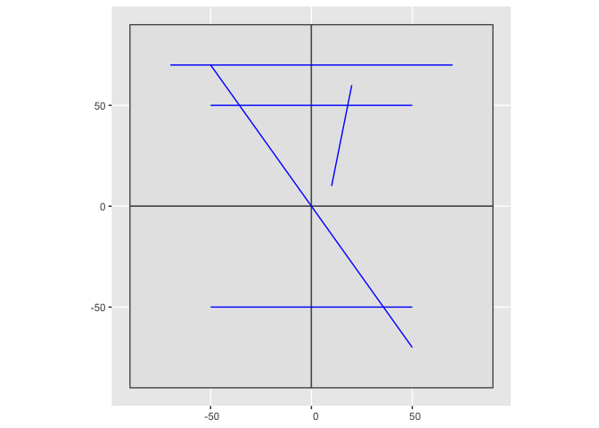

Set up
------

Purpose: To calculate the number of lines that intersect two polygons.

First, let’s create a toy example.

``` r
rm(list = ls())
library(data.table)
library(raster)
```

    ## Loading required package: sp

    ## 
    ## Attaching package: 'raster'

    ## The following object is masked from 'package:data.table':
    ## 
    ##     shift

``` r
library(sp)
library(sf)
```

    ## Linking to GEOS 3.6.1, GDAL 2.1.3, PROJ 4.9.3

``` r
library(ggplot2)

## Create lines object
cds1 <- rbind(c(-50, 50), c(50,50))
cds2 <- rbind(c(-50, -50), c(50,-50))
cds3 <- rbind(c(-50, 70), c(50,-70))
cds4 <- rbind(c(10, 10), c(20,60))
cds5 <- rbind(c(-70, 70), c(70,70))

lines <- sf::st_as_sf(spLines(cds1, cds2,cds3, cds4, cds5, attr=data.frame(Lid=1:5)))

## Create polygon object
p1 <- rbind(c(0,0), c(0,90), c(-90, 90), c(-90,0))
p2 <- rbind(c(0,0), c(0,90), c(90, 90), c(90,0))
p3 <- rbind(c(0,0), c(0,-90), c(-90, -90), c(-90,0))
p4 <- rbind(c(0,0), c(90,0), c(90, -90), c(0,-90))

pols <- sf::st_as_sf(spPolygons(p1, p2,p3, p4,attr=data.frame(Pid=1:4)))

## Plot polygons and lines
ggplot(pols) + geom_sf() + geom_sf(data = lines, color = "blue")
```



Solution
--------

Here’s a function to that requires an Pid column in the polygon object
and a Lid column in the linestring object.

``` r
## Function taking in polygon and linestring sf objects. Need a Pid column in the polygon object and Lid column in the linestring object. 

GetNumberOfIntersectingLines <- function(PolygonObj = pols, LineObj = lines) {
  # find intersections
  dt <- suppressWarnings(as.data.table(sf::st_intersection(lines, pols)))

  CJFunc <- function(ID =1) {
    TmpDat <- CJ(as.numeric(t(dt[Lid == ID, .(Pid)])), as.numeric(t(dt[Lid == ID, .(Pid)])))
    TmpDat <- TmpDat[V1 != V2]
  }

  testDat <- rbindlist(lapply(dt[, unique(Lid)], CJFunc))

  setnames(testDat, old = c("V1","V2"), new = c("Pid_1", "Pid_2"))

  testDat <- testDat[, .N, by = .(Pid_1,Pid_2)]

  return(testDat)
}

testDat <- GetNumberOfIntersectingLines(PolygonObj = pols, LineObj = lines)
testDat
```

    ##     Pid_1 Pid_2 N
    ##  1:     1     2 3
    ##  2:     2     1 3
    ##  3:     1     3 1
    ##  4:     1     4 1
    ##  5:     2     3 1
    ##  6:     2     4 1
    ##  7:     3     1 1
    ##  8:     3     2 1
    ##  9:     3     4 2
    ## 10:     4     1 1
    ## 11:     4     2 1
    ## 12:     4     3 2

This function outputs an edge list with the number of intersecting lines
between each polygon with at least one line intersecting both polygons.
The polygons IDs are positioned such that the top left represents Pid =
1, top right represents 2, bottom left represents 3, bottom right
represents 4. So there are three lines crossing between the top left
polygon and the top right polygon. Note that the long diagonal line is
considered to intersect all four polygons since they share the 0,0
coordinate.
